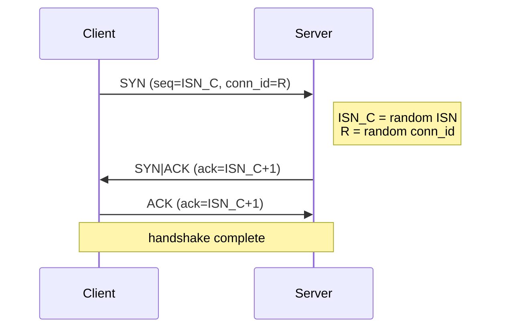
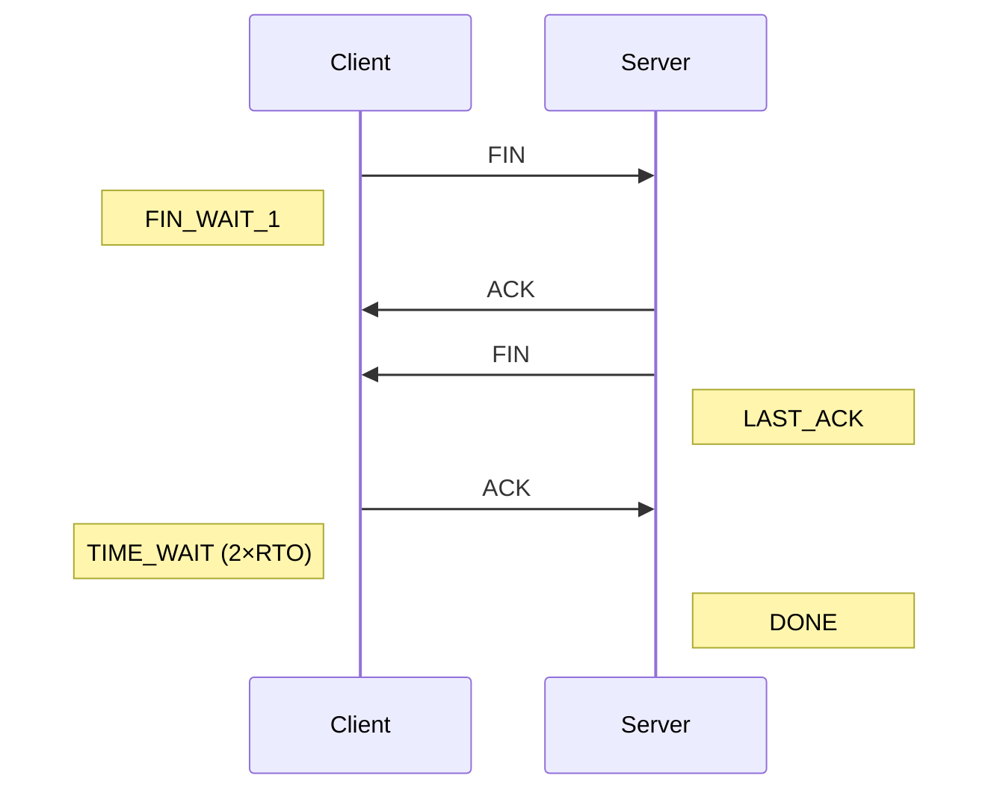
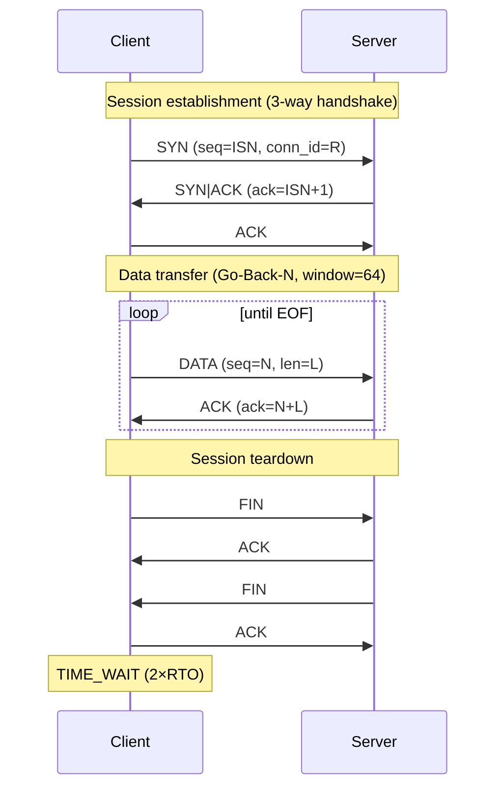
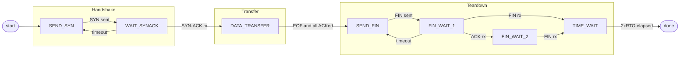
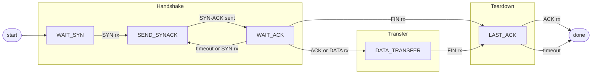

# IPK Project 2 — Reliable File Transfer over UDP

**Author:** Matej Mikuš  
**Login:** xmikusm00  
**Date:** 2026-05-03

---

## Overview

`ipk-rdt` is a UDP-based reliable file transfer tool implementing a custom transport protocol with a 3-way handshake, sliding window (Go-Back-N with server-side receive buffer), cumulative ACKs, fast retransmit, and adaptive retransmission timing based on RFC 6298.

---

## Build & Run

```sh
make              # builds ./ipk-rdt
make clean        # removes ./ipk-rdt and src/*.o
```

**Server:**
```sh
./ipk-rdt -s -p PORT [-a ADDRESS] [-o OUTPUT] [-w TIMEOUT]
```

**Client:**
```sh
./ipk-rdt -c -a HOST -p PORT [-i INPUT] [-w TIMEOUT]
```

| Option | Description |
|--------|-------------|
| `-s` | Start in server (receiver) mode |
| `-c` | Start in client (sender) mode |
| `-p PORT` | UDP port number |
| `-a ADDRESS/HOST` | Bind address (server) or destination hostname/IP (client) |
| `-i INPUT` | Input file to send; `-` or omit for stdin |
| `-o OUTPUT` | Output file to write; `-` or omit for stdout |
| `-w TIMEOUT` | Inactivity timeout in whole seconds (default: 1) |
| `-h`, `--help` | Print usage and exit with code 0 |

**Quick local smoke test:**
```sh
./ipk-rdt -s -p 9000 -o /tmp/out.bin &
./ipk-rdt -c -a 127.0.0.1 -p 9000 -i /tmp/in.bin
cmp /tmp/in.bin /tmp/out.bin
```

---

## Protocol Design

### PDU Header Format

Every PDU begins with a fixed 16-byte header (packed, no padding):

```
 0                   1                   2                   3
 0 1 2 3 4 5 6 7 8 9 0 1 2 3 4 5 6 7 8 9 0 1 2 3 4 5 6 7 8 9 0 1
+-+-+-+-+-+-+-+-+-+-+-+-+-+-+-+-+-+-+-+-+-+-+-+-+-+-+-+-+-+-+-+-+
|                        Connection ID (32 bits)                 |
+-+-+-+-+-+-+-+-+-+-+-+-+-+-+-+-+-+-+-+-+-+-+-+-+-+-+-+-+-+-+-+-+
|                      Sequence Number (32 bits)                 |
+-+-+-+-+-+-+-+-+-+-+-+-+-+-+-+-+-+-+-+-+-+-+-+-+-+-+-+-+-+-+-+-+
|                  Cumulative ACK Number (32 bits)               |
+-+-+-+-+-+-+-+-+-+-+-+-+-+-+-+-+-+-+-+-+-+-+-+-+-+-+-+-+-+-+-+-+
|         Payload Length (16 bits)      | Flags (8) | Cksum (8) |
+-+-+-+-+-+-+-+-+-+-+-+-+-+-+-+-+-+-+-+-+-+-+-+-+-+-+-+-+-+-+-+-+
```

| Field | Size | Description |
|-------|------|-------------|
| `conn_id` | 4 B | Random connection identifier chosen by the client at SYN |
| `seq` | 4 B | Byte-offset sequence number of the first payload byte |
| `ack` | 4 B | Cumulative ACK — next expected byte offset |
| `length` | 2 B | Number of payload bytes following the header |
| `flags` | 1 B | Bitmask: `SYN=0x01`, `ACK=0x02`, `FIN=0x04`, `DATA=0x08` |
| `checksum` | 1 B | XOR checksum over header (with checksum=0) + payload |

Maximum PDU size is **1200 bytes** of UDP payload, giving a maximum payload of **1184 bytes** per segment.

### Integrity Protection

Checksum is computed as the XOR of every byte of the header (checksum field zeroed) concatenated with the payload. The receiver zeros the checksum field, recomputes, and discards the PDU on mismatch.

### Connection Identification

The client picks a random 32-bit `conn_id` at connection setup. Every subsequent PDU in the session carries the same `conn_id`. PDUs with an unexpected `conn_id` are silently discarded, preventing cross-transfer confusion.

---

## Session Establishment

Three-way handshake:



The client picks a random Initial Sequence Number (ISN). RTT is measured from SYN send to SYN-ACK receipt and used to seed the retransmission timer.

---

## Session Termination

Four-way teardown (TCP-style):



The server sends ACK and FIN as separate PDUs. If the client does not receive the server's ACK/FIN, it retransmits FIN from `FIN_WAIT_1`. The client stays in `TIME_WAIT` for 2×RTO to absorb any FIN retransmissions from the server, responding with ACK each time. After the `TIME_WAIT` deadline the client moves to `DONE`.

---

## Sequencing and Acknowledgement

- **Byte-based sequence numbers** (same semantics as TCP).
- **Cumulative ACKs**: the `ack` field carries the next expected byte offset. The sender slides the window forward for every slot whose `seq + len <= cum_ack`.
- **Go-Back-N** retransmission: on timeout, all unacknowledged segments in the window are retransmitted in order.

---

## Sliding Window

| Parameter | Value |
|-----------|-------|
| Window size | 64 segments |
| Maximum segment payload | 1184 bytes |
| Maximum bytes in flight | ~74 KB |

The sender maintains a circular array of `WindowSlot` entries. New data is loaded from the input stream until the window is full, then the sender waits for ACKs before advancing.

---

## Retransmission Strategy

Retransmission timing follows **RFC 6298**:

- `SRTT` and `RTTVAR` are updated on every non-retransmitted ACK using EWMA (α = 1/8, β = 1/4).
- `RTO = SRTT + 4 × RTTVAR`, clamped to [0.01 s, 60 s].
- Initial RTO is 0.01 s before the first RTT sample.

**Timeout retransmission:** if the oldest unacknowledged segment has been in the window longer than `RTO`, the entire window is retransmitted (Go-Back-N).

**Fast retransmit (RFC 5681):** three consecutive duplicate ACKs trigger an immediate retransmit of only the oldest unacknowledged segment (`SND.UNA`) without waiting for the timer. The RTO is not modified on fast retransmit.

---

## Timeout and Progress Tracking

`-w TIMEOUT` defines the maximum interval without *protocol progress*. Progress is defined as:

- A new handshake step completing.
- An ACK that advances the cumulative acknowledgement pointer.
- Receipt of new (non-duplicate) data on the server.
- A successful teardown step.

If no progress is observed for `TIMEOUT` seconds, the application terminates with exit code 1.

---

## Duplicate and Out-of-Order Packet Handling

- **Duplicates:** packets with `seq < expected_seq` are silently discarded; a cumulative ACK for `expected_seq` is still sent.
- **Out-of-order:** the server maintains a `std::map<uint32_t, std::vector<char>>` receive buffer (TCP without SACK approach). Segments with `seq > expected_seq` and within one window range are stored. When the missing segment arrives and fills the gap, all contiguous buffered segments are flushed to output in one pass and a single cumulative ACK covering the whole block is sent.
- **Corrupt PDUs:** all received PDUs pass through `validate_pdu()` which checks minimum size, payload length bounds, and XOR checksum. Any failure causes silent discard.

---

## UML Diagrams

### Protocol Sequence Diagram



### Client State Machine



### Server State Machine



---

## Measured Behavior

Tests were run on loopback (127.0.0.1) without network impairment:

| Input size | Transfer time | Notes |
|------------|--------------|-------|
| 0 bytes (empty) | < 0.1 s | Handshake + immediate FIN |
| ~1 KB | < 0.1 s | Single segment |
| ~10 MB | ~0.3 s | Window fully pipelined |

Network impairment was simulated with `tc netem`:

```sh
sudo tc qdisc add dev lo root netem loss 5% delay 20ms 5ms reorder 10%
./ipk-rdt -s -p 9000 -o /tmp/out.bin &
./ipk-rdt -c -a 127.0.0.1 -p 9000 -i /tmp/in.bin -w 5
cmp /tmp/in.bin /tmp/out.bin    # passes
sudo tc qdisc del dev lo root
```

---

## Known Limitations

- **Fixed window size:** the window is always 64 segments regardless of network conditions; no congestion control is implemented.
- **XOR checksum:** weaker than CRC-32 or ones-complement sum — cannot detect all even-count bit flip patterns or byte swaps.
- **Sequence number wrap-around:** 32-bit byte-offset sequence numbers wrap at ~4 GB; transfers larger than 4 GB are not supported.
- **No transfer resume:** a process crash requires restarting both sides.

---

## Testing

Tests are located in `tester/tester.sh` and can be run with:

```sh
make test
```

The script requires `sudo` for `tc netem` impairment tests. It automatically cleans up network rules and temporary files on exit.

Clean-network tests use `-w 3`, impairment tests use `-w 10` to give the protocol enough room to recover without hitting the progress timeout. The server port is checked with `ss` before the client starts to avoid race conditions.

### Test cases

| # | Name | Input size | `-w` | Impairment | What it verifies |
|---|------|-----------|------|------------|-----------------|
| 1 | Empty file | 0 bytes | 3 | None | Handshake + immediate FIN with no data |
| 2 | Single byte | 1 byte | 3 | None | Minimum non-empty transfer |
| 3 | Exact max payload | 1184 bytes | 3 | None | Single segment boundary (MAX_PAYLOAD_SIZE) |
| 4 | Exact full window | 75 776 bytes | 3 | None | Exactly 64 segments in flight |
| 5 | 5% packet loss | 1 MB | 10 | `loss 5%` | Retransmission on loss |
| 6 | 20 ms delay | 1 MB | 10 | `delay 20ms` | RTO adapts to higher latency |
| 7 | 15% reorder + 10 ms | 1 MB | 10 | `delay 10ms reorder 15%` | Out-of-order receive buffer and gap filling |
| 8 | 10% loss + 30 ms + 20% reorder | 1 MB | 10 | `loss 10% delay 30ms reorder 20%` | Combined adverse conditions |
| 9 | 10 MB stress | 10 MB | 3 | None | Sustained pipelining throughput |
| 10 | Fast retransmit | 1 MB | 10 | `loss 10%` | 3 duplicate ACK fast retransmit path |
| 11 | High latency | 1 MB | 10 | `delay 100ms` | Correct timeout scaling at high RTT |
| 12 | 20 MB large transfer | 20 MB | 3 | None | Large file integrity |
| CLI-1 | `-h` flag | — | — | — | Exit code 0 on help |
| CLI-2 | Missing mode | — | — | — | Exit code 1, error to stderr |
| CLI-3 | Missing port | — | — | — | Exit code 1, error to stderr |
| CLI-4 | Invalid port 99999 | — | — | — | Exit code 1, port validation |
| CLI-5 | Non-existent input file | — | — | — | Exit code 1, file open error |
| CLI-6 | Invalid timeout `-w -5` | — | — | — | Exit code 1, timeout validation |

All transfer tests verify output byte-for-byte with `cmp`.

---

## AI Usage


  AI assistance (Claude Sonnet 4.6), (Gemini 3.1 PRO) was used in this project for the following purposes:

  - Clarifying the assignment — explaining parts of the specification and relevant standards (RFC 9293, RFC 6298, RFC 5681) that were not
  immediately clear.
  - Code comments — generating file headers and inline RFC-reference comments.
  - Test script — generating the tester/tester.sh test suite structure and individual test cases.
  - Documentation — generating and proofreading README.md sections.

  The protocol design, state machine logic, and implementation were developed by the author. The primary inspiration for the protocol design
  was KUROSE, J. F. and ROSS, K. W. Computer Networking: A Top-Down Approach. Pearson. Ideas were communicated to the AI in pseudocode and
  natural language and then implemented independently.

---

## Standards and Inspirations

| Feature | Inspired by |
|---------|-------------|
| Transport layer (UDP) | **RFC 768** — User Datagram Protocol |
| 3-way handshake, 4-way teardown | **RFC 9293** — Transmission Control Protocol (§3.4, §3.6) |
| Byte-based sequence numbers, cumulative ACKs | **RFC 9293** — TCP sequence space (§3.3) |
| Sliding window / pipelining | **RFC 9293** — TCP send/receive window (§3.7) |
| Retransmission timer (SRTT, RTTVAR, RTO) | **RFC 6298** — Computing TCP's Retransmission Timer |
| Fast retransmit on 3 duplicate ACKs | **RFC 5681** — TCP Congestion Control (§3.2) |
| TIME_WAIT state on the active closer | **RFC 9293** — TCP TIME-WAIT (§3.6.1) |
| Out-of-order receive buffer, gap filling | **RFC 9293** — TCP out-of-order queuing (§3.4) |
| Connection identifier per session | **RFC 9000** — QUIC (§5.1, connection ID concept); adapted for UDP without TLS |
| Go-Back-N retransmission policy | KUROSE, J. F. and ROSS, K. W. *Computer Networking: A Top-Down Approach*, ch. 3 |

## Sources

- RFC 768: User Datagram Protocol
- RFC 5681: TCP Congestion Control
- RFC 6298: Computing TCP's Retransmission Timer
- RFC 9000: QUIC — A UDP-Based Multiplexed and Secure Transport
- RFC 9293: Transmission Control Protocol
- KUROSE, J. F. and ROSS, K. W. *Computer Networking: A Top-Down Approach*. Pearson.
