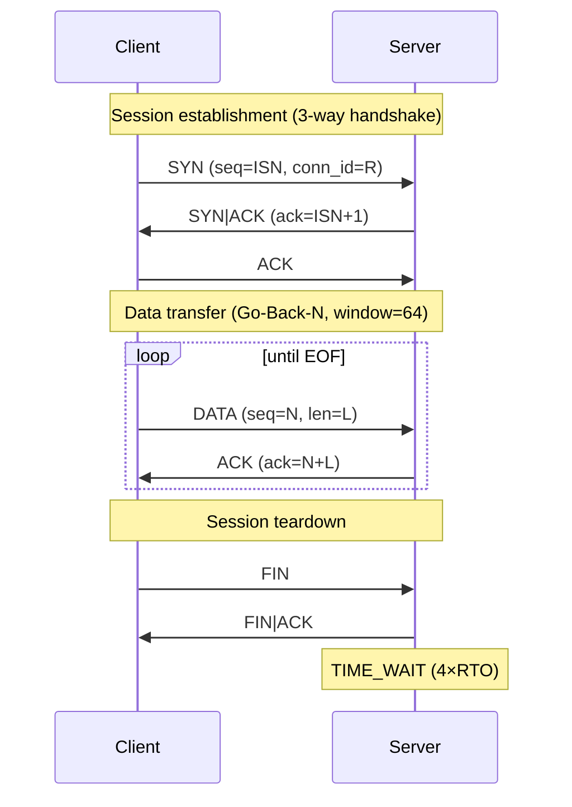
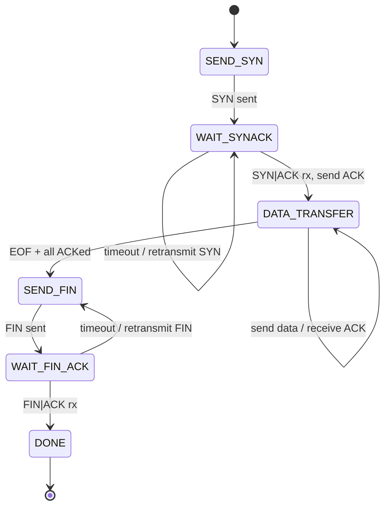
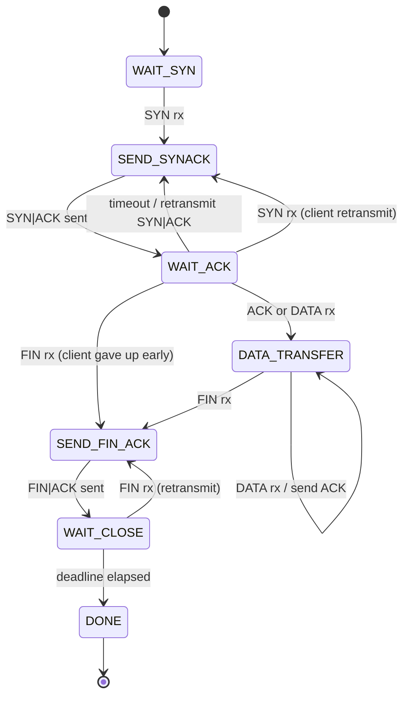

# IPK Project 2 — Reliable File Transfer over UDP

**Author:** Matej Mikuš  
**Login:** xmikusm00  
**Date:** 2026-05-03

---

## Overview

`ipk-rdt` is a UDP-based reliable file transfer tool implementing a custom transport protocol with a 3-way handshake, sliding window (Go-Back-N), cumulative ACKs, and adaptive retransmission timing based on RFC 6298.

---

## Build & Run

```sh
make              # builds ./ipk-rdt
make clean        # removes ./ipk-rdt and src/*.o
```

**Server:**
```sh
./ipk-rdt -s -p PORT [-a ADDRESS] [-o OUTPUT] [-w TIMEOUT]
```

**Client:**
```sh
./ipk-rdt -c -a HOST -p PORT [-i INPUT] [-w TIMEOUT]
```

| Option | Description |
|--------|-------------|
| `-s` | Start in server (receiver) mode |
| `-c` | Start in client (sender) mode |
| `-p PORT` | UDP port number |
| `-a ADDRESS/HOST` | Bind address (server) or destination hostname/IP (client) |
| `-i INPUT` | Input file to send; `-` or omit for stdin |
| `-o OUTPUT` | Output file to write; `-` or omit for stdout |
| `-w TIMEOUT` | Inactivity timeout in whole seconds (default: 1) |
| `-h`, `--help` | Print usage and exit with code 0 |

**Quick local smoke test:**
```sh
./ipk-rdt -s -p 9000 -o /tmp/out.bin &
./ipk-rdt -c -a 127.0.0.1 -p 9000 -i /tmp/in.bin
cmp /tmp/in.bin /tmp/out.bin
```

---

## Protocol Design

### PDU Header Format

Every PDU begins with a fixed 16-byte header (packed, no padding):

```
 0                   1                   2                   3
 0 1 2 3 4 5 6 7 8 9 0 1 2 3 4 5 6 7 8 9 0 1 2 3 4 5 6 7 8 9 0 1
+-+-+-+-+-+-+-+-+-+-+-+-+-+-+-+-+-+-+-+-+-+-+-+-+-+-+-+-+-+-+-+-+
|                        Connection ID (32 bits)                 |
+-+-+-+-+-+-+-+-+-+-+-+-+-+-+-+-+-+-+-+-+-+-+-+-+-+-+-+-+-+-+-+-+
|                      Sequence Number (32 bits)                 |
+-+-+-+-+-+-+-+-+-+-+-+-+-+-+-+-+-+-+-+-+-+-+-+-+-+-+-+-+-+-+-+-+
|                  Cumulative ACK Number (32 bits)               |
+-+-+-+-+-+-+-+-+-+-+-+-+-+-+-+-+-+-+-+-+-+-+-+-+-+-+-+-+-+-+-+-+
|         Payload Length (16 bits)      | Flags (8) | Cksum (8) |
+-+-+-+-+-+-+-+-+-+-+-+-+-+-+-+-+-+-+-+-+-+-+-+-+-+-+-+-+-+-+-+-+
```

| Field | Size | Description |
|-------|------|-------------|
| `conn_id` | 4 B | Random connection identifier chosen by the client at SYN |
| `seq` | 4 B | Byte-offset sequence number of the first payload byte |
| `ack` | 4 B | Cumulative ACK — next expected byte offset |
| `length` | 2 B | Number of payload bytes following the header |
| `flags` | 1 B | Bitmask: `SYN=0x01`, `ACK=0x02`, `FIN=0x04`, `DATA=0x08` |
| `checksum` | 1 B | XOR checksum over header (with checksum=0) + payload |

Maximum PDU size is **1200 bytes** of UDP payload, giving a maximum payload of **1184 bytes** per segment.

### Integrity Protection

Checksum is computed as the XOR of every byte of the header (checksum field zeroed) concatenated with the payload. The receiver zeros the checksum field, recomputes, and discards the PDU on mismatch.

### Connection Identification

The client picks a random 32-bit `conn_id` at connection setup. Every subsequent PDU in the session carries the same `conn_id`. PDUs with an unexpected `conn_id` are silently discarded, preventing cross-transfer confusion.

---

## Session Establishment

Three-way handshake:

```
Client                            Server
  |                                  |
  |-- SYN (seq=ISN_C, conn_id=R) --> |   ISN_C = random initial seq number
  |                                  |   R = random conn_id
  | <-- SYN|ACK (ack=ISN_C+1) --    |
  |                                  |
  |-- ACK (ack=ISN_C+1) -----------> |   handshake complete
  |                                  |
```

The client picks a random Initial Sequence Number (ISN). RTT is measured from SYN send to SYN-ACK receipt and used to seed the retransmission timer.

---

## Session Termination

```
Client                            Server
  |                                  |
  |-- FIN --------------------------> |
  |                                  |
  | <-- FIN|ACK --------------------- |
  |                                  |   Server waits up to 4×RTO for
  |                                  |   FIN retransmissions (TIME_WAIT)
```

If the client does not receive FIN|ACK, it retransmits FIN. If the server receives a retransmitted FIN during its wait window, it resends FIN|ACK. After the wait expires the server moves to DONE.

---

## Sequencing and Acknowledgement

- **Byte-based sequence numbers** (same semantics as TCP).
- **Cumulative ACKs**: the `ack` field carries the next expected byte offset. The sender slides the window forward for every slot whose `seq + len <= cum_ack`.
- **Go-Back-N** retransmission: on timeout, all unacknowledged segments in the window are retransmitted in order.

---

## Sliding Window

| Parameter | Value |
|-----------|-------|
| Window size | 64 segments |
| Maximum segment payload | 1184 bytes |
| Maximum bytes in flight | ~74 KB |

The sender maintains a circular array of `WindowSlot` entries. New data is loaded from the input stream until the window is full, then the sender waits for ACKs before advancing.

---

## Retransmission Strategy

Retransmission timing follows **RFC 6298**:

- `SRTT` and `RTTVAR` are updated on every non-retransmitted ACK using EWMA (α = 1/8, β = 1/4).
- `RTO = SRTT + 4 × RTTVAR`, clamped to [0.1 s, 60 s].
- Initial RTO is 0.2 s before the first RTT sample.

**Timeout retransmission:** if the oldest unacknowledged segment has been in the window longer than `RTO`, the entire window is retransmitted (Go-Back-N).

**Fast retransmit:** three consecutive duplicate ACKs trigger an immediate retransmit of the entire window without waiting for the timer.

---

## Timeout and Progress Tracking

`-w TIMEOUT` defines the maximum interval without *protocol progress*. Progress is defined as:

- A new handshake step completing.
- An ACK that advances the cumulative acknowledgement pointer.
- Receipt of new (non-duplicate) data on the server.
- A successful teardown step.

If no progress is observed for `TIMEOUT` seconds, the application terminates with exit code 1.

---

## Duplicate and Out-of-Order Packet Handling

- **Duplicates:** the server compares incoming `seq` to `expected_seq`. Packets with `seq ≠ expected_seq` are silently dropped; a cumulative ACK for the already-received data is still sent, allowing the sender to detect the gap.
- **Out-of-order:** the server has no receive buffer; out-of-order segments are dropped and the client's Go-Back-N retransmit mechanism re-delivers them in order.
- **Corrupt PDUs:** checksum mismatch causes silent discard on both client and server.

---

## UML Diagrams

### Protocol Sequence Diagram



### Client State Machine



### Server State Machine



---

## Measured Behavior

Tests were run on loopback (127.0.0.1) without network impairment:

| Input size | Transfer time | Notes |
|------------|--------------|-------|
| 0 bytes (empty) | < 0.1 s | Handshake + immediate FIN |
| ~1 KB | < 0.1 s | Single segment |
| ~10 MB | ~0.3 s | Window fully pipelined |

Network impairment was simulated with `tc netem`:

```sh
sudo tc qdisc add dev lo root netem loss 5% delay 20ms 5ms reorder 10%
./ipk-rdt -s -p 9000 -o /tmp/out.bin &
./ipk-rdt -c -a 127.0.0.1 -p 9000 -i /tmp/in.bin -w 5
cmp /tmp/in.bin /tmp/out.bin    # passes
sudo tc qdisc del dev lo root
```

---

## Known Limitations

- **No receive buffer on the server:** out-of-order segments are discarded. Under high reorder rates the client's Go-Back-N retransmits, but efficiency degrades compared to Selective Repeat.
- **Fixed window size:** the window is always 64 segments regardless of network conditions; no congestion control is implemented.
- **Single transfer per server invocation:** the server exits after one complete transfer or failure.
- **IPv6 dual-stack:** the implementation iterates `getaddrinfo` results and uses the first address family that succeeds; explicit dual-stack is not configured.
- **No transfer resume:** a process crash requires restarting both sides.

---

## Sources

- RFC 768: User Datagram Protocol
- RFC 9293: Transmission Control Protocol
- RFC 6298: Computing TCP's Retransmission Timer
- KUROSE, J. F. and ROSS, K. W. *Computer Networking: A Top-Down Approach*. Pearson.
- Linux `tc-netem` manual page
